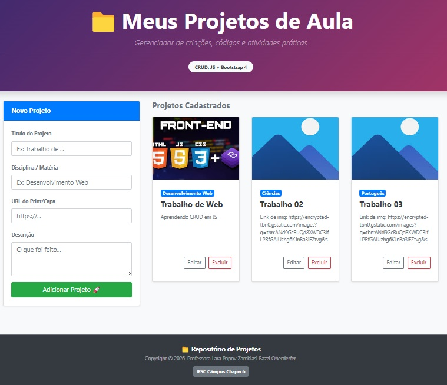

# work-lister-app-full-crud-js
# 📁 Organizador de Projetos de Aula

> Um sistema de gerenciamento de projetos (CRUD) desenvolvido para auxiliar estudantes na organização e exibição de suas criações e atividades práticas de programação.

## 🚀 Sobre o Projeto

O **Organizador de Projetos** é uma aplicação web interativa que simula um painel/dashboard de portfólio. Ele permite que o usuário adicione, liste, edite e remova projetos desenvolvidos em ambiente de aula, tornando o aprendizado de operações de banco de dados e persistência de dados (CRUD) muito mais visual e contextualizado com a realidade dos alunos.

Este projeto foi desenhado sob medida para turmas de tecnologia, trocando exemplos tradicionais (como cadastros de livros ou produtos) por algo que eles mesmos produzem no dia a dia.

---

## 🛠️ Tecnologias e Recursos Utilizados

O desenvolvimento do ecossistema foca na manipulação dinâmica do Front-End integrado a um back-end simulado:

* **HTML5:** Estruturação semântica da aplicação.
* **Bootstrap 4.1.3:** Framework CSS utilizado para garantir um design moderno, responsivo e baseado em componentes (Cards, Badges e Utilitários de Grid).
* **JavaScript (ES6):** Lógica de programação para manipulação assíncrona do DOM, delegação de eventos e requisições HTTP.
* **JSON-Server (Node.js):** Utilizado para simular uma API REST Mock completa com persistência de dados local.

---

## ⚙️ Funcionalidades (CRUD)

* **[C]reate (Adicionar):** Formulário lateral intuitivo que envia via requisição `POST` um novo projeto com Título, Disciplina, URL da imagem de capa e Descrição.
* **[R]ead (Listar):** Renderização dinâmica em um sistema de grid responsivo de 3 colunas, adaptando-se a telas de computadores, tablets ou smartphones.
* **[U]pdate (Editar):** Abertura de formulário *inline* diretamente dentro do card correspondente, permitindo a alteração dos dados em tempo real via requisição `PATCH`.
* **[D]elete (Excluir):** Remoção lógica e física do card tanto da interface quanto do banco de dados fictício através do método `DELETE`.

---

## 📦 Como Executar o Projeto

### Pró-requisitos
Antes de começar, você vai precisar ter instalado em sua máquina o [Node.js](https://nodejs.org/).

### 1. Clonar ou baixar o repositório
git clone [https://github.com/laraoberderfer/crud-js-bootstrap.git](https://github.com/laraoberderfer/crud-js-bootstrap.git)

### 2. Iniciar o Servidor Back-End (Mock API)
O projeto utiliza o pacote json-server para simular as rotas da API. Certifique-se de estar usando uma versão do Node compatível e rode o seguinte comando global para instalar (caso ainda não tenha) e rodar o banco local:

# Instalar o json-server globalmente (se necessário)
npm install -g json-server

# Executar o servidor apontando para o seu arquivo work.json
json-server --watch work.json

O servidor iniciará por padrão na porta http://localhost:3000

### 3. Executar o Front-End
Basta abrir o arquivo index.html diretamente em seu navegador ou utilizar a extensão Live Server no VS Code para rodar a aplicação localmente.

---
Desenvolvido como material de apoio pedagógico e prático para as disciplinas de desenvolvimento web.
Docente Responsável: Professora Lara Popov Zambiasi Bazzi Oberderfer
Instituição: Instituto Federal de Santa Catarina (IFSC) — Câmpus Chapecó
Ano: 2026
